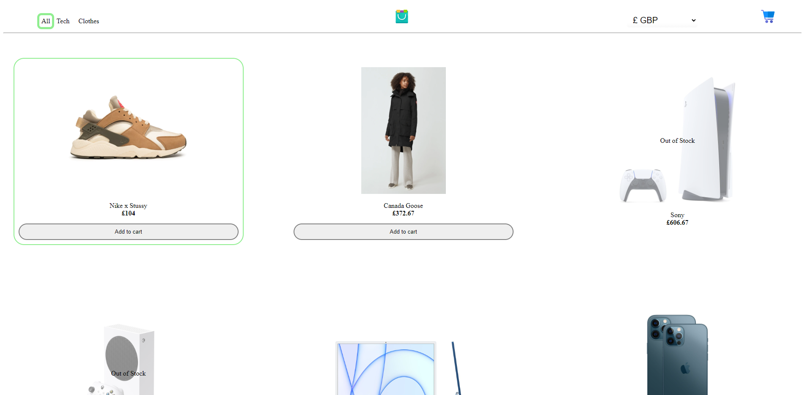

# Project Name: WebShop
### Author: Hans-Märten Liiu
 

Main Idea:
-------------

Make a store webpage that has cart and currency changing ability

## Application functional details:
* You can navigate through diffrent categories
* You can open item's detailed view
* You can change currency on website
* You can add items to cart
* You increase item amount in cart
* You decrease item amount in cart

 

## What can be done next:
* On item page, when item is added to cart then remove attribute selection together with add to cart button and say to client that it is already in cart
* Flexible design

 

## How to boot the application:
* For backend, with CMD you have to move to backend folder, then type yarn build and after that type yarn start.
* For frontend, with CMD you have to move to webshop folder and type npm start.

 

## Images of the application
* Items Page

* Item Hover

* DetailedView

* Currency Change

* MiniCart

* Cart

 

## Some images taken from:
* https://www.flaticon.com/
* https://maketext.io/
* https://loading.io/css
* https://favicon.io/
* https://pixabay.com/illustrations/green-pattern-background-wallpaper-2696878/

