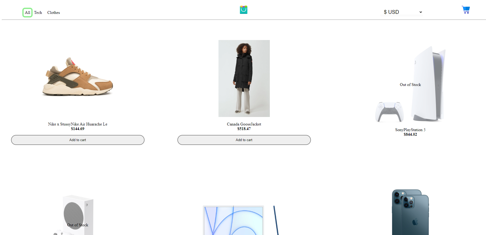

# Project Name: WebShop
### Author: Hans-Märten Liiu
 

Main Idea:
-------------

Make a store webpage that has cart and currency changing ability

## Application functional details:
* You can open item's detailed view

 

## How to boot the application:
* For backend, with CMD you have to move to backend folder and type yarn start.
* For frontend, with CMD you have to move to my-app folder and type npm start.

 

## Images of the application
* Items Page

* Item Hover

* DetailedView

 

## Testid
* Backendi testi käivitamiseks tuleb rakendus dockeris käivitada ning dockeri Command Lines öelda käsk npm test
* FrontEndi testide jaoks on vaja kommenteerida failides PictureLoader, PictureLoaderAll, ProfilePictureLoader, OtherProfilePage, PostDetailedView välja piltide importimine ning see järel on võimalik öelda dockeri command lines npm test. (Lisame ka pildi illustreerimaks, mis osa tuleb välja kommenteerida, et rakenduse testimisel ei tekiks errorit)

 

## Some images taken from:
* https://www.flaticon.com/
* https://maketext.io/
* https://loading.io/css
* https://favicon.io/
* https://pixabay.com/illustrations/green-pattern-background-wallpaper-2696878/

